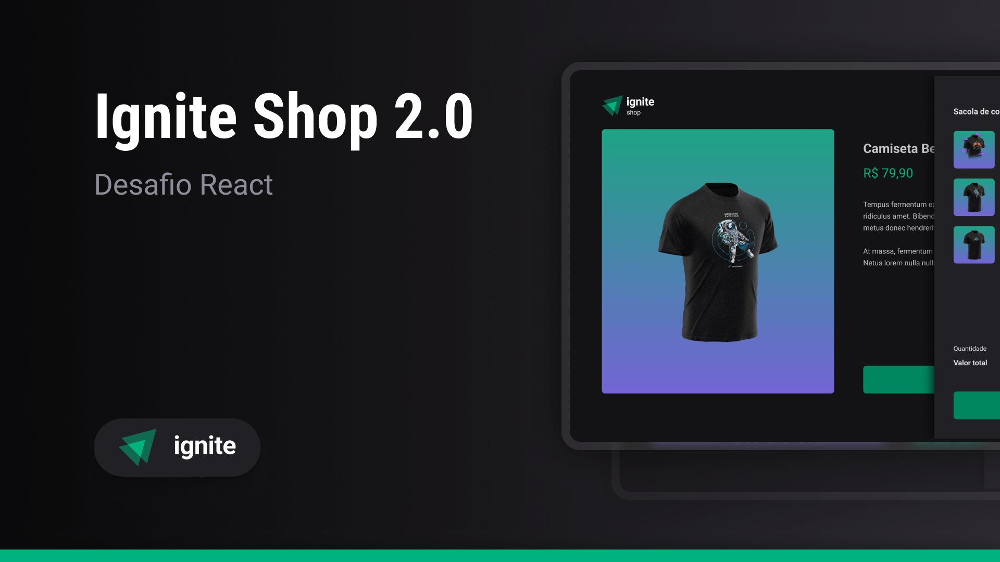

> Ignite - Desafio #4

# Shop

## Sobre o desafio

O desafio consiste em desenvolver um e-commerce para uma loja fictícia de camisetas, que contém as seguintes funcionalidades:

- Listar produtos cadastrados no Stripe
- Exibir detalhes numa página de produto
- Adicionar um produto à cesta de compras
- Remover um produto da cesta de compras
- Exibir o total de produtos na cesta de compras no header
- Listar produtos na cesta de compras
- Finalizar a compra usando checkout do Stripe
- Exibir dados da compra na página de sucesso

## O que foi usado

- React
- TypeScript
- Next.js
- Tailwind
- Tailwind-Variants
- Zustand
- Swiper
- Stripe
- Eslint
- Prettier

> O desafio original não inclui Tailwind, Swiper, Zustand, Eslint e Prettier
